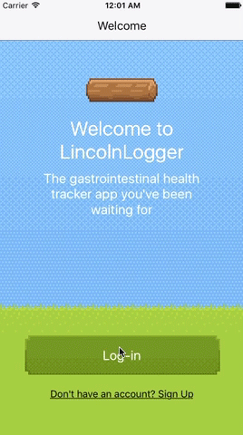

# LincolnLogger


A simple iOS app written in `React Native` making use of `Redux` for robust data flow and `react-native-router-flux` for a fully native experience.

Communicates with a RESTful JSON API written in Ruby on Rails. API available at [lincoln-logger-api.herokuapp.com](lincoln-logger-api.herokuapp.com)


## A health tracker to keep you regular
Log your logs in this groundbreaking gastrointestinal health tracker app.
  0. Keep an eye on your regularity
  0. Make progress toward objectives and construct a wonderful log cabin

Why? The GPS signal is too weak in most bathrooms to play Pokemon. This is the next best option.

Coming soon: share your cabins with your friends, and compare your regularity to community averages.

Coming soon to the App Store.

## Installation

Basic React Native setup requirements [here](https://facebook.github.io/react-native/docs/getting-started.html).

Summary:

0. Install Xcode

1. Install Node.js 4.0 or newer. `$ brew install node`
    a. [NVM](https://github.com/creationix/nvm#installation) is also useful to manage your node version.

2. Install [watchman](https://facebook.github.io/watchman/), which like `gulp watch` detects file changes and rebuilds assets `$ brew install watchman`.

3. Install RN binary`$ npm install -g react-native-cli`

4. Run with `$ react-native start`


## iOS Simulator

0. `$ open ios/stopwatch.xcodeproj/` - Opens the iOS sub-project in Xcode.

1. Click the "Play" button in Xcode

## Features and Implementation

## Authentication


As a mobile application, LincolnLogger does not have access to cookies. Every user data request includes an authentication token provided on login by the LincolnLogger API. The API confirms the user's identity and returns the desired information.

`thunk` is used with `fetch` to link dispatch calls as callbacks to the asynchronous API requests.

```javascript
// ./src/actions/authActions.js

export const logLog = (token) => {
  return (dispatch, state) => {
    dispatch({
      type: types.LOG_REQ_STARTED
    });

    fetch(`${loggerApiBaseUrl}logs`, {
      method: 'POST',
      headers: {
        'session_token': token
      }
    })
    .then(response => response.json())
    .then(responseJson => {
      dispatch({
        type: types.LOG_RECEIVED,
        log: responseJson
      });
    })
    .catch(error => {
      console.log(error)
    });
  }
}
```


## Managing State
LincolnLogger uses [Redux](http://redux.js.org/), a predictable state container, to manage the app state.

`authActions` and `logActions` are initiated from components. They issue asynchronous HTTP requests using `fetch`. Actions are dispatched to the store based on the success or error of requests, and handled by the reducer responsible for the impacted aspect of the state (e.g. the `authReducer` for `state.auth`, `logsReducer` for `state.logs` or `loadingReducer` for `state.loading`).

The state is treated as immutable and replaced with a new state, rather than mutated in place, to ensure a clear revision history.

```javascript
// ./src/reducers/logsReducer.js

import * as types from '../actions/actionTypes';
const initialState = [];

export default function logs(state = initialState, action = {}) {
  switch (action.type) {
    case types.LOG_RECEIVED:
      return [
        ...state,
        action.log
      ];
    case types.LOGS_RECEIVED:
      return action.logs;
    case types.RESET_LOGS:
      return initialState;
    default:
      return state
  }
}
```

The store is passed down through a `Provider` component. State and actions are made available to individual components by wrapping them in containers using Redux's `connect` and `bindActionCreators` functions.
